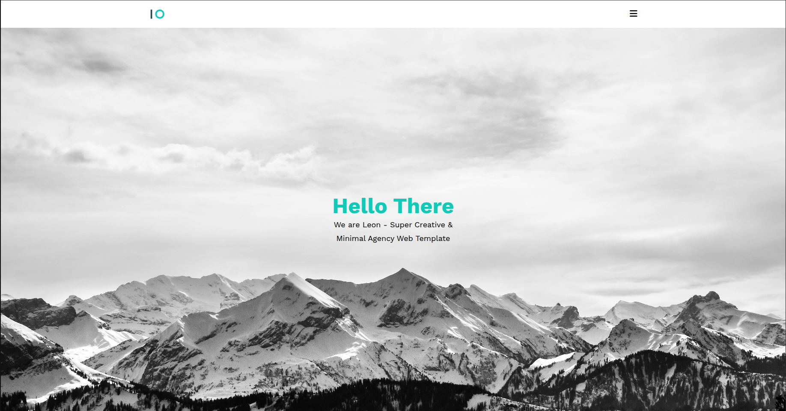

# Leon

### Responsive Web Design of Leon Template:

- Responsive Website Using HTML and CSS.
- Developed first with the Mobile First methodology, then for desktop.
- Compatible with all mobile devices and with a beautiful and pleasant user interface.

<!-- Social Media -->

💙 Follow me on Twitter. [@weirdocodes][twitter]
💙 Connect with me on LinkedIn . [@muhammad-mamdouh99][linkedin]

<!-- Notes -->

> This project is inspired from This [PSD][leon].
> I built this project on linux and deployed it using [surge][surge].
> [Live Demo][demo]

<!-- Links -->

[twitter]: https://x.com/weirdocodes
[linkedin]: https://www.linkedin.com/in/muhammad-mamdouh99/
[leon]: https://www.graphberry.com/item/leon-psd-agency-template
[surge]: https://surge.sh/
[demo]: https://magnificent-leon.surge.sh/

<!-- Live Demo -->

<!-- Screen Shot -->

